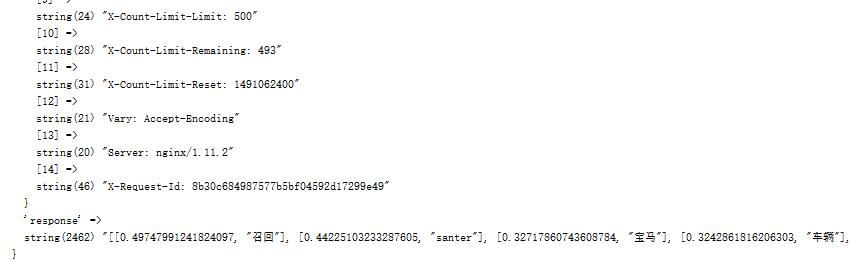
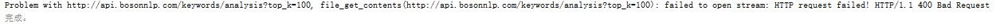

#### 简介
简单的封装了BosonNLP中文语义识别的api。
#### 安装
composer require xdao/boson-nlp
#### 使用
```php
require 'vendor/autoload.php';

use Xdao\Util\BosonNLP;

$news = <<<EOF
继前不久始于中国的召回风波，宝马因为车辆的发动机螺栓故障，在全球范围将召回48.9万辆车，在原有中国召回的基础上数量进一步增加。
据悉，召回车辆将包括北美市场的15.6万辆，宝马曾于3月宣布在华召回232,098辆发动机螺栓故障车辆。涉及车型包括搭载六缸发动机的宝马5系、7系、X3、X5，。
但具体型号Santer并没有透露。宝马发言人Bernhard Santer表示，目前尚无该故障造成事故或伤亡的报告。但他仍建议相关车主及时检查车辆引擎。
Santer说，凭借剩余的动力，车辆仍旧可以坚持到最近的修理厂。
EOF;

//example1 不抛出异常
$bnlp = new BosonNLP("your_key");
$response= $bnlp->keywords($news."\"")
if($response){
 var_dump($response);
}

//example2 抛出异常
$bnlp = new BosonNLP("your_key",true,true);
try {
    $response= $bnlp->keywords($news."\""); 
    var_dump($response);
} catch (Exception $ex) {
    echo $ex->getMessage();
}

//example3 去除英文标点

$response= $bnlp->keywords(BosonNLP::removePunct($news."\""));
var_dump($response); 

```
#### 注意
- 为了简洁，使用的是php内置的file_get_contents，不支持异步,返回原始所有数据，未做处理

- 有两种处理错误方式，一种是错误时返回false，一种是抛出异常

- BosonNLP有点傻，如果末尾带了英文的引号就不能处理了，如上exampl2，于是提供了一个去除英文标点的静态方法removePunct
- 详细的文档，请查阅[官网](http://docs.bosonnlp.com/getting_started.html)


